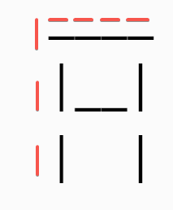
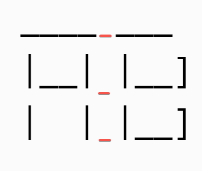
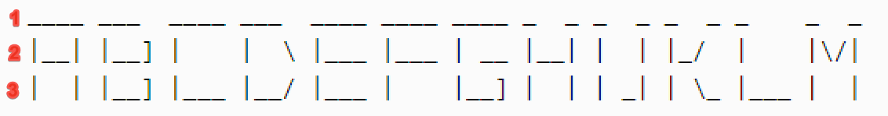

# Ascii Text Signature

## Stage 1 - Primitive Art

### Description

An ASCII generator is an awesome program that can output any document, picture, or text file in 2-D using only text
symbols. It is often used to print name tag badges for various conferences and meetings. In this project, you will write
an ASCII generator that can print name tags.

Let's start with generating the simplest name tag with just a first name and a last name on it. Your task is to generate
a tag for someone with the first name "Hyper" and the last name "Skill". You also need to create a frame around the text
as shown in the example.

### Objectives

Print the string “Hyper Skill” in a frame.

Your program should output the string “Hyper Skill” in a frame. Left and right borders are marked with the symbol '|',
the top border is marked with '_', and the bottom border with '•'.

### Examples

```
 _____________
| Hyper Skill |
 •••••••••••••
```

## Stage 2 - Star quality

### Description

Now, let’s make our program more versatile. In this stage, you will write a program that creates a name tag for unique
first and last names.

### Objectives

Your program should read first and last names from standard input and then output them in a frame. The name tag should
contain the first and last name with a single space between them, a single space at the beginning, and another space at
the end.

The frame should consist of asterisk symbols '*'. Remember about single spaces between the border of the tag and the
personal name.

### Examples

**Example 1**, when the user inputs Albert Einstein:

```
*******************
* Albert Einstein *
*******************
```

**Example 2**, when the user inputs Nikola Tesla:

```
****************
* Nikola Tesla *
****************
```

## Stage 3 - Make it notable

### Description

Now, let's change the font of the text. The new font will be larger and will consist of multiple rows and columns of
standard console symbols.

The new font is shown below:

```
____ ___  ____ ___  ____ ____ ____ _  _ _  _ _  _ _    _  _
|__| |__] |    |  \ |___ |___ | __ |__| |  | |_/  |    |\/|
|  | |__] |___ |__/ |___ |    |__] |  | | _| | \_ |___ |  |
_  _ ____ ___  ____ ____ ____ ___ _  _ _  _ _ _ _ _  _ _   _ ___ 
|\ | |  | |__] |  | |__/ [__   |  |  | |  | | | |  \/   \_/    / 
| \| |__| |    |_\| |  \ ___]  |  |__|  \/  |_|_| _/\_   |    /__
```

The tag contains the name and the status.

The name includes the first and the last name separated by a space. It should be printed using the provided font.

The status could be "VIP", "Employee", "Speaker", "Administrator", "Participant", or something else. These statuses
should appear on the tag below the person's name. This information is not as important as the name, so it should be
printed in a smaller font.

In some cases, the width of the tag may have an even number of symbols, while the status has an odd number of symbols (
or vice versa). In these cases, you cannot generate a horizontally centered status, since it will always be offset by
one extra space on the left or on the right. In this case, your program should move the status to the left so there is
one space less to the left of the status than to the right.

### Objectives

Your program should read a person's first and last names and status from standard input and create a personal name tag.
The name should be printed with the provided font and the personal status with a regular font.

The program has the following requirements:

- Personal status is printed below the personal name.
- The name and status should sit right in the middle of the line. If, due to the number of symbols, the status cannot be
  centered, the program should leave an extra space to the right of it.
- If the name is longer than the status, leave two spaces to the left and to the right of the name. Otherwise, leave two
  spaces to the left and to the right of the status. Note that there should not be empty lines between the top border
  and the name.

Some details about the font style:

- The font has uppercase letters only. It is made of the following symbols: ```'_', '|', '/', '\', ']', '['```.
- The first name and the last name should contain a column of single spaces between the adjacent letters for better
  readability.
- The interval between the first and the last name should contain six spaces including indents.

Hint:

Every letter in the font is 3-symbol high and 4-symbol wide, except ```I, J, T, W, and Y```.

For example, the letter ```“A”``` is 3-symbol high and 4-symbol wide:



As you can see, each letter contains a column of whitespaces as a delimiter.



We suggest saving the font in one of the two following ways:

1. Save the alphabet as a list of 3 string list's containing the symbols of the three rows. Note that letters in the
   font are separated by a column of spaces:



2. You can also save each letter as a List of strings(top, middle, bottom). Example:

```kotlin
mutableListOf("____", "|__|", "|  |") // A
```

Or you can think of a method of your own!

### Examples

Note that strings Enter the first and last name: and Enter the person's status: are not part of the input.

**Example 1:**

```
Enter name and surname: Bill Gates
Enter person's status: VIP
***************************************************
*  ___  _ _    _         ____ ____ ___ ____ ____  *
*  |__] | |    |         | __ |__|  |  |___ [__   *
*  |__] | |___ |___      |__] |  |  |  |___ ___]  *
*                       VIP                       *
***************************************************
```

**Example 2:**

```
Enter name and surname: Tom Smith
Enter person's status: Worker
*********************************************
*  ___ ____ _  _      ____ _  _ _ ___ _  _  *
*   |  |  | |\/|      [__  |\/| |  |  |__|  *
*   |  |__| |  |      ___] |  | |  |  |  |  *
*                  Worker                   *
*********************************************
```

**Example 3:**

```
Enter name and surname: Mr Anonimous
Enter person's status: Participant
**************************************************************
*  _  _ ____      ____ _  _ ____ _  _ _ _  _ ____ _  _ ____  *
*  |\/| |__/      |__| |\ | |  | |\ | | |\/| |  | |  | [__   *
*  |  | |  \      |  | | \| |__| | \| | |  | |__| |__| ___]  *
*                        Participant                         *
**************************************************************
```

**Example 4:**

```
Enter name and surname: John S
Enter person's status: Worker-coworker-superdupercoworker
****************************************
*      _ ____ _  _ _  _      ____      *
*      | |  | |__| |\ |      [__       *
*     _| |__| |  | | \|      ___]      *
*  Worker-coworker-superdupercoworker  *
****************************************
```

## Stage 4 - ASCII New Roman

### Description

Let's increase the text size and use another font, which looks very similar to the existing font called "Times New
Roman".

The first four lowercase characters of this Roman font are shown below in this new font:

```
           .o8                       .o8
          "888                      "888
 .oooo.    888oooo.   .ooooo.   .oooo888
`P  )88b   d88' `88b d88' `"Y8 d88' `888
 .oP"888   888   888 888       888   888
d8(  888   888   888 888   .o8 888   888
`Y888""8o  `Y8bod8P' `Y8bod8P' `Y8bod88P"
```

You can download [this font](https://stepik.org/media/attachments/lesson/226140/roman.txt), along with the smaller and
less fancy [font](https://stepik.org/media/attachments/lesson/226140/medium.txt) from the previous example (the Medium
font). The file contains information about the font size and about all lowercase and uppercase letters.

In this stage, you need to create a program that generates a name tag using the new font.

### Objectives

Your program should generate a person's name tag using the Roman font. Also, it should print the personal status using
the Medium font.

Both fonts have a special description included in their .txt file. The first line of the file contains two numbers. The
first number is the font size, which indicates how many lines are needed to print one character using this font. For
example, the Medium font, which you used in the previous stage, needs 3 lines, and the Roman font needs 10. The second
number is the number of characters described in the file. The file for each font contains information about 52
characters: 26 uppercase and 26 lowercase letters.

The next lines contain information about each character, one after another. The character information includes the name
of the character, the width of the character, and in the next lines, the way the character is represented in ASCII
symbols.

Note that these fonts already contain a column of spaces after each font character, so you don't need to add any.

What you need to do :

- download the Roman and Medium fonts. The Medium font has been used in the previous stage;
- read the personal name and status from standard input like in the previous stage;
- output the name tag with the status in a frame; find the necessary characters in the .txt files of the two provided
  fonts.
- to create the borders of the frame, use ```‘88’```.

The personal status should be centered horizontally. If the status is longer than the full name, then the full name
should be centered.

When the status is shorter than the full name, use 2 columns of whitespaces between the first letter of the name and
left border and 3 columns between the last letter of the full name and the right border, not including the indents in
the font (and vice versa).

There are three blank lines in height between the personal name and the personal status.

Use 6 spaces between the words in the Medium font is 6 symbols in the Medium font (including indents). In the Roman
font, your program should insert 10 spaces between the words.

### Examples

**Example 1:**
```
Enter name and surname: Ian One
Enter person's status: VIP
888888888888888888888888888888888888888888888888888888888888888888888888888888888
88  ooooo                                   .oooooo.                           88
88  `888'                                  d8P'  `Y8b                          88
88   888   .oooo.   ooo. .oo.             888      888 ooo. .oo.    .ooooo.    88
88   888  `P  )88b  `888P"Y88b            888      888 `888P"Y88b  d88' `88b   88
88   888   .oP"888   888   888            888      888  888   888  888ooo888   88
88   888  d8(  888   888   888            `88b    d88'  888   888  888    .o   88
88  o888o `Y888""8o o888o o888o            `Y8bood8P'  o888o o888o `Y8bod8P'   88
88                                                                             88
88                                                                             88
88                                                                             88
88                                _  _ _ ___                                   88
88                                |  | | |__]                                  88
88                                 \/  | |                                     88
888888888888888888888888888888888888888888888888888888888888888888888888888888888
```

**Example 2:**
```
Enter name and surname: A b
Enter person's status: long participant
88888888888888888888888888888888888888888888888888888888888888888888888888888888
88                         .o.                  .o8                           88
88                        .888.                "888                           88
88                       .8"888.                888oooo.                      88
88                      .8' `888.               d88' `88b                     88
88                     .88ooo8888.              888   888                     88
88                    .8'     `888.             888   888                     88
88                   o88o     o8888o            `Y8bod8P'                     88
88                                                                            88
88                                                                            88
88                                                                            88
88  _    ____ _  _ ____      ___  ____ ____ ___ _ ____ _ ___  ____ _  _ ___   88
88  |    |  | |\ | | __      |__] |__| |__/  |  | |    | |__] |__| |\ |  |    88
88  |___ |__| | \| |__]      |    |  | |  \  |  | |___ | |    |  | | \|  |    88
88888888888888888888888888888888888888888888888888888888888888888888888888888888
```