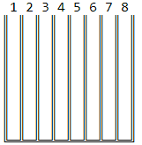
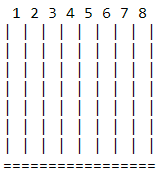

# Connect Four

## Stage 1 - Input game parameters

### Description

Connect Four is a classic game where players drop colorful discs onto a vertical board. The main goal of the game is to
form a line of four discs of the same color horizontally, vertically, or diagonally.

In this project, you will create a software version of this game. Typically, the game board has 6 rows and 7 columns,
but in this version, the number of rows and columns can vary from 5 to 9.

In this stage, the program should read the players' names and the board size from the console input.

The board size is input in the following format: `<Rows> X <Columns>` or `<Rows> x <Columns>`, for example, 7 X 8 or
8x9. Whitespaces (spaces and tabs) have no effect.

### Objectives

The program should print the program title `Connect Four`, ask for the 1st player's name with the
prompt `First player's name:`, and read it. Then it should ask for the 2nd player's name with the
prompt `Second player's name:` and read it.

Subsequently, the program should ask for the board dimensions with the following prompt:

```
Set the board dimensions (Rows x Columns)
Press Enter for default (6 x 7)
```

Once the dimensions are entered, it should read them (Examples 1, 3). Ignore any whitespaces. If users press the Enter
button right away (ignoring the dimension prompt), then the board size is 6 rows and 7 columns (see Example 2).

If the number of rows is outside the 5-9 range, print the following message `Board rows should be from 5 to 9` and ask
for dimensions once again (see Example 3).

If the number of columns is outside the 5-9 range, print the following message `Board columns should be from 5 to 9` and
ask for dimensions once again (see Example 3).

If users fail to input dimensions in the correct format, print `Invalid input` and ask for dimensions once again (see
Example 4).

Finally, output the following message:

```
<1st player's name> VS <2nd players name>
<Rows> X <Columns> board
```

### Examples

The greater-than symbol followed by a space (> ) represents the user input. Note that it's not part of the input.

**Example 1:** defining the board size

```
Connect Four
First player's name:
> Ava
Second player's name:
> Oliver
Set the board dimensions (Rows x Columns)
Press Enter for default (6 x 7)
> 7 x 9
Ava VS Oliver
7 X 9 board
```

**Example 2:** pressing Enter to get the default board size

```
Connect Four
First player's name:
> Ava
Second player's name:
> Oliver
Set the board dimensions (Rows x Columns)
Press Enter for default (6 x 7)
>
Ava VS Oliver
6 X 7 board
```

**Example 3:** invalid board size

```
Connect Four
First player's name:
> Oliver
Second player's name:
> Ava
Set the board dimensions (Rows x Columns)
Press Enter for default (6 x 7)
> 4x7
Board rows should be from 5 to 9
Set the board dimensions (Rows x Columns)
Press Enter for default (6 x 7)
> 10x7
Board rows should be from 5 to 9
Set the board dimensions (Rows x Columns)
Press Enter for default (6 x 7)
> 7 x 4
Board columns should be from 5 to 9
Set the board dimensions (Rows x Columns)
Press Enter for default (6 x 7)
> 7 X 10
Board columns should be from 5 to 9
Set the board dimensions (Rows x Columns)
Press Enter for default (6 x 7)
> 5X9
Oliver VS Ava
5 X 9 board
```

**Example 4:** invalid input

```
Connect Four
First player's name:
> Ava
Second player's name:
> Oliver
Set the board dimensions (Rows x Columns)
Press Enter for default (6 x 7)
> 6 7
Invalid input
Set the board dimensions (Rows x Columns)
Press Enter for default (6 x 7)
> 6_7
Invalid input
Set the board dimensions (Rows x Columns)
Press Enter for default (6 x 7)
> 6 V 7
Invalid input
Set the board dimensions (Rows x Columns)
Press Enter for default (6 x 7)
> 6x7
Ava VS Oliver
6 X 7 board
```

## Stage 2  Game board

### Description

In this stage, you need to draw the game board by using the `║, ╚, ═, ╩, ╝` box-drawing characters. You can find more
information about these characters in the
corresponding [Wikipedia article](https://en.wikipedia.org/wiki/Box-drawing_character), but you can also simply copy
them.

Construct a board in the manner shown in the following example for a 7x8 board:


Print the column number above each respective column and use the above-mentioned box-drawing characters for creating the
board lines. You can find more board types in the Examples section.

There is the possibility, due to a known issue, that the `║, ╚, ═, ╩, ╝` box-drawing characters can't be correctly
printed at the console output. Instead, the `?` character is printed for each of them. If this situation arises, then
implement the board by using the plain text | and = plain text characters as following. Either case will be accepted as
a valid solution. Also, a plain text board example is available at each stage.



The board size can vary, so your program should adapt to any possible size.

### Objectives

1. Draw and print the board set by users according to the procedure above;
2. Print the column numbers on the board. Mind the spaces between characters.

### Examples

The greater-than symbol followed by a space (> ) represents the user input. Note that it's not part of the input.

**Example 1:** printing the board

```
Connect Four
First player's name:
> Sophia
Second player's name:
> John
Set the board dimensions (Rows x Columns)
Press Enter for default (6 x 7)
> 8 x 8
Sophia VS John
8 X 8 board
 1 2 3 4 5 6 7 8
║ ║ ║ ║ ║ ║ ║ ║ ║
║ ║ ║ ║ ║ ║ ║ ║ ║
║ ║ ║ ║ ║ ║ ║ ║ ║
║ ║ ║ ║ ║ ║ ║ ║ ║
║ ║ ║ ║ ║ ║ ║ ║ ║
║ ║ ║ ║ ║ ║ ║ ║ ║
║ ║ ║ ║ ║ ║ ║ ║ ║
║ ║ ║ ║ ║ ║ ║ ║ ║
╚═╩═╩═╩═╩═╩═╩═╩═╝
```

**Example 2:** the default size board

```
Connect Four
First player's name:
> Sophia
Second player's name:
> John
Set the board dimensions (Rows x Columns)
Press Enter for default (6 x 7)
>
Sophia VS John
6 X 7 board
 1 2 3 4 5 6 7
║ ║ ║ ║ ║ ║ ║ ║
║ ║ ║ ║ ║ ║ ║ ║
║ ║ ║ ║ ║ ║ ║ ║
║ ║ ║ ║ ║ ║ ║ ║
║ ║ ║ ║ ║ ║ ║ ║
║ ║ ║ ║ ║ ║ ║ ║
╚═╩═╩═╩═╩═╩═╩═╝
```

**Example 3:** plain text board

```
Connect Four
First player's name:
> Sophia
Second player's name:
> John
Set the board dimensions (Rows x Columns)
Press Enter for default (6 x 7)
> 7 x 8
Sophia VS John
7 X 8 board
 1 2 3 4 5 6 7 8
| | | | | | | | |
| | | | | | | | |
| | | | | | | | |
| | | | | | | | |
| | | | | | | | |
| | | | | | | | |
| | | | | | | | |
=================
```

## Stage 3 - Game logic

### Description

Players use red and yellow colored discs in the "hardware" version of the game. In this project, we are going to
substitute them with `o` and `*` characters. The `o` is for the first player.

Each player inputs a column number one after another. The program must read the input and print the appropriate
character (`o` or `*`) on the first available position at the bottom of that column. If the user input isn't correct,
print the appropriate message and ask for a new one (see Examples). The program should also check whether a column is
full or not. If it is, no more discs can be added to it.

If players input `end` instead of a column number, terminate the program and print the respective message.

### Objectives

In addition to the functionality from the previous stage, your game should perform the following:

1. Ask each player to input a column number by prompting `<First player's name>'s turn:`
   or `<Second player's name>'s turn:`. Read the column number and print o or * on the first available position of that
   column. The first player is o; the second player is *. If either player inputs end, terminate the program and print
   `Game over!` (see Example 1).
2. If the input contains an integer number outside the scope of available columns, warn the players with
   the `The column number is out of range (1 - <Max column number>)` message and ask for it once again. If players'
   input doesn't contain an integer, warn the players with `Incorrect column number` and ask for it once again (see
   Example 2).
3. If the column is full, print the following message `Column <Column number> is full` and ask to input another column
   number (see Example 2).

### Examples

The greater-than symbol followed by a space (> ) represents the user input. Note that it's not part of the input.

**Example 1:** normal execution

```
Connect Four
First player's name:
> Mia
Second player's name:
> Bill
Set the board dimensions (Rows x Columns)
Press Enter for default (6 x 7)
> 6x8
Mia VS Bill
6 X 8 board
 1 2 3 4 5 6 7 8
║ ║ ║ ║ ║ ║ ║ ║ ║
║ ║ ║ ║ ║ ║ ║ ║ ║
║ ║ ║ ║ ║ ║ ║ ║ ║
║ ║ ║ ║ ║ ║ ║ ║ ║
║ ║ ║ ║ ║ ║ ║ ║ ║
║ ║ ║ ║ ║ ║ ║ ║ ║
╚═╩═╩═╩═╩═╩═╩═╩═╝
Mia's turn:
> 4
 1 2 3 4 5 6 7 8
║ ║ ║ ║ ║ ║ ║ ║ ║
║ ║ ║ ║ ║ ║ ║ ║ ║
║ ║ ║ ║ ║ ║ ║ ║ ║
║ ║ ║ ║ ║ ║ ║ ║ ║
║ ║ ║ ║ ║ ║ ║ ║ ║
║ ║ ║ ║ο║ ║ ║ ║ ║
╚═╩═╩═╩═╩═╩═╩═╩═╝
Bill's turn:
> 4
 1 2 3 4 5 6 7 8
║ ║ ║ ║ ║ ║ ║ ║ ║
║ ║ ║ ║ ║ ║ ║ ║ ║
║ ║ ║ ║ ║ ║ ║ ║ ║
║ ║ ║ ║ ║ ║ ║ ║ ║
║ ║ ║ ║*║ ║ ║ ║ ║
║ ║ ║ ║ο║ ║ ║ ║ ║
╚═╩═╩═╩═╩═╩═╩═╩═╝
Mia's turn:
> 5
 1 2 3 4 5 6 7 8
║ ║ ║ ║ ║ ║ ║ ║ ║
║ ║ ║ ║ ║ ║ ║ ║ ║
║ ║ ║ ║ ║ ║ ║ ║ ║
║ ║ ║ ║ ║ ║ ║ ║ ║
║ ║ ║ ║*║ ║ ║ ║ ║
║ ║ ║ ║ο║ο║ ║ ║ ║
╚═╩═╩═╩═╩═╩═╩═╩═╝
Bill's turn:
> 4
 1 2 3 4 5 6 7 8
║ ║ ║ ║ ║ ║ ║ ║ ║
║ ║ ║ ║ ║ ║ ║ ║ ║
║ ║ ║ ║ ║ ║ ║ ║ ║
║ ║ ║ ║*║ ║ ║ ║ ║
║ ║ ║ ║*║ ║ ║ ║ ║
║ ║ ║ ║ο║ο║ ║ ║ ║
╚═╩═╩═╩═╩═╩═╩═╩═╝
Mia's turn:
> 7
 1 2 3 4 5 6 7 8
║ ║ ║ ║ ║ ║ ║ ║ ║
║ ║ ║ ║ ║ ║ ║ ║ ║
║ ║ ║ ║ ║ ║ ║ ║ ║
║ ║ ║ ║*║ ║ ║ ║ ║
║ ║ ║ ║*║ ║ ║ ║ ║
║ ║ ║ ║ο║ο║ ║ο║ ║
╚═╩═╩═╩═╩═╩═╩═╩═╝
Bill's turn:
> 8
 1 2 3 4 5 6 7 8
║ ║ ║ ║ ║ ║ ║ ║ ║
║ ║ ║ ║ ║ ║ ║ ║ ║
║ ║ ║ ║ ║ ║ ║ ║ ║
║ ║ ║ ║*║ ║ ║ ║ ║
║ ║ ║ ║*║ ║ ║ ║ ║
║ ║ ║ ║ο║ο║ ║ο║*║
╚═╩═╩═╩═╩═╩═╩═╩═╝
Mia's turn:
> 8
 1 2 3 4 5 6 7 8
║ ║ ║ ║ ║ ║ ║ ║ ║
║ ║ ║ ║ ║ ║ ║ ║ ║
║ ║ ║ ║ ║ ║ ║ ║ ║
║ ║ ║ ║*║ ║ ║ ║ ║
║ ║ ║ ║*║ ║ ║ ║ο║
║ ║ ║ ║ο║ο║ ║ο║*║
╚═╩═╩═╩═╩═╩═╩═╩═╝
Bill's turn:
> 1
 1 2 3 4 5 6 7 8
║ ║ ║ ║ ║ ║ ║ ║ ║
║ ║ ║ ║ ║ ║ ║ ║ ║
║ ║ ║ ║ ║ ║ ║ ║ ║
║ ║ ║ ║*║ ║ ║ ║ ║
║ ║ ║ ║*║ ║ ║ ║ο║
║*║ ║ ║ο║ο║ ║ο║*║
╚═╩═╩═╩═╩═╩═╩═╩═╝
Mia's turn:
> end
Game over!
```

**Example 2:** warning messages

```
Connect Four
First player's name:
> Mia
Second player's name:
> Bill
Set the board dimensions (Rows x Columns)
Press Enter for default (6 x 7)
> 7 x 8
Mia VS Bill
7 X 8 board
 1 2 3 4 5 6 7 8
║ ║ ║ ║ ║ ║ ║ ║ ║
║ ║ ║ ║ ║ ║ ║ ║ ║
║ ║ ║ ║ ║ ║ ║ ║ ║
║ ║ ║ ║ ║ ║ ║ ║ ║
║ ║ ║ ║ ║ ║ ║ ║ ║
║ ║ ║ ║ ║ ║ ║ ║ ║
║ ║ ║ ║ ║ ║ ║ ║ ║
╚═╩═╩═╩═╩═╩═╩═╩═╝
Mia's turn:
> 0
The column number is out of range (1 - 8)
Mia's turn:
> 9
The column number is out of range (1 - 8)
Mia's turn:
> a12
Incorrect column number
Mia's turn:
> 1
 1 2 3 4 5 6 7 8
║ ║ ║ ║ ║ ║ ║ ║ ║
║ ║ ║ ║ ║ ║ ║ ║ ║
║ ║ ║ ║ ║ ║ ║ ║ ║
║ ║ ║ ║ ║ ║ ║ ║ ║
║ ║ ║ ║ ║ ║ ║ ║ ║
║ ║ ║ ║ ║ ║ ║ ║ ║
║ο║ ║ ║ ║ ║ ║ ║ ║
╚═╩═╩═╩═╩═╩═╩═╩═╝
Bill's turn:
> 1
 1 2 3 4 5 6 7 8
║ ║ ║ ║ ║ ║ ║ ║ ║
║ ║ ║ ║ ║ ║ ║ ║ ║
║ ║ ║ ║ ║ ║ ║ ║ ║
║ ║ ║ ║ ║ ║ ║ ║ ║
║ ║ ║ ║ ║ ║ ║ ║ ║
║*║ ║ ║ ║ ║ ║ ║ ║
║ο║ ║ ║ ║ ║ ║ ║ ║
╚═╩═╩═╩═╩═╩═╩═╩═╝
Mia's turn:
> 1
 1 2 3 4 5 6 7 8
║ ║ ║ ║ ║ ║ ║ ║ ║
║ ║ ║ ║ ║ ║ ║ ║ ║
║ ║ ║ ║ ║ ║ ║ ║ ║
║ ║ ║ ║ ║ ║ ║ ║ ║
║ο║ ║ ║ ║ ║ ║ ║ ║
║*║ ║ ║ ║ ║ ║ ║ ║
║ο║ ║ ║ ║ ║ ║ ║ ║
╚═╩═╩═╩═╩═╩═╩═╩═╝
Bill's turn:
> 1
 1 2 3 4 5 6 7 8
║ ║ ║ ║ ║ ║ ║ ║ ║
║ ║ ║ ║ ║ ║ ║ ║ ║
║ ║ ║ ║ ║ ║ ║ ║ ║
║*║ ║ ║ ║ ║ ║ ║ ║
║ο║ ║ ║ ║ ║ ║ ║ ║
║*║ ║ ║ ║ ║ ║ ║ ║
║ο║ ║ ║ ║ ║ ║ ║ ║
╚═╩═╩═╩═╩═╩═╩═╩═╝
Mia's turn:
> 1
 1 2 3 4 5 6 7 8
║ ║ ║ ║ ║ ║ ║ ║ ║
║ ║ ║ ║ ║ ║ ║ ║ ║
║ο║ ║ ║ ║ ║ ║ ║ ║
║*║ ║ ║ ║ ║ ║ ║ ║
║ο║ ║ ║ ║ ║ ║ ║ ║
║*║ ║ ║ ║ ║ ║ ║ ║
║ο║ ║ ║ ║ ║ ║ ║ ║
╚═╩═╩═╩═╩═╩═╩═╩═╝
Bill's turn:
> 1
 1 2 3 4 5 6 7 8
║ ║ ║ ║ ║ ║ ║ ║ ║
║*║ ║ ║ ║ ║ ║ ║ ║
║ο║ ║ ║ ║ ║ ║ ║ ║
║*║ ║ ║ ║ ║ ║ ║ ║
║ο║ ║ ║ ║ ║ ║ ║ ║
║*║ ║ ║ ║ ║ ║ ║ ║
║ο║ ║ ║ ║ ║ ║ ║ ║
╚═╩═╩═╩═╩═╩═╩═╩═╝
Mia's turn:
> 1
 1 2 3 4 5 6 7 8
║ο║ ║ ║ ║ ║ ║ ║ ║
║*║ ║ ║ ║ ║ ║ ║ ║
║ο║ ║ ║ ║ ║ ║ ║ ║
║*║ ║ ║ ║ ║ ║ ║ ║
║ο║ ║ ║ ║ ║ ║ ║ ║
║*║ ║ ║ ║ ║ ║ ║ ║
║ο║ ║ ║ ║ ║ ║ ║ ║
╚═╩═╩═╩═╩═╩═╩═╩═╝
Bill's turn:
> 1
Column 1 is full
Bill's turn:
> end
Game over!
```

**Example 3:** plain text example

```
Connect Four
First player's name:
> Mia
Second player's name:
> Bill
Set the board dimensions (Rows x Columns)
Press Enter for default (6 x 7)
> 5x7
Mia VS Bill
5 X 7 board
 1 2 3 4 5 6 7
| | | | | | | |
| | | | | | | |
| | | | | | | |
| | | | | | | |
| | | | | | | |
===============
Mia's turn:
> 2
 1 2 3 4 5 6 7
| | | | | | | |
| | | | | | | |
| | | | | | | |
| | | | | | | |
| |o| | | | | |
===============
Bill's turn:
> 3
 1 2 3 4 5 6 7
| | | | | | | |
| | | | | | | |
| | | | | | | |
| | | | | | | |
| |o|*| | | | |
===============
Mia's turn:
> 2
 1 2 3 4 5 6 7
| | | | | | | |
| | | | | | | |
| | | | | | | |
| |o| | | | | |
| |o|*| | | | |
===============
Bill's turn:
> 2
 1 2 3 4 5 6 7
| | | | | | | |
| | | | | | | |
| |*| | | | | |
| |o| | | | | |
| |o|*| | | | |
===============
Mia's turn:
> 1
 1 2 3 4 5 6 7
| | | | | | | |
| | | | | | | |
| |*| | | | | |
| |o| | | | | |
|o|o|*| | | | |
===============
Bill's turn:
> 4
 1 2 3 4 5 6 7
| | | | | | | |
| | | | | | | |
| |*| | | | | |
| |o| | | | | |
|o|o|*|*| | | |
===============
Mia's turn:
> end
Game over!
```

## Stage 4 - Winning condition

### Description

Now, it is time to implement the winning condition. A player wins when they place four discs of the same color in a row
horizontally, vertically, or diagonally. After each move, the program checks if the condition is met. Also, if the board
is full and the win condition isn't fulfilled, claim it a draw.

### Objectives

In addition to what we have added before, your program should do the following:

1. Check the board for the winning condition. If a player wins, output `Player <Player's name> won`;
2. If the board is full, but neither of the players has won, print `It is a draw`;
3. Regardless of whether it is a draw or somebody's victory, print `Game Over!` and terminate the program.

### Examples

The greater-than symbol followed by a space (> ) represents the user input. Note that it's not part of the input.

**Example 1:** the first player wins by placing four discs in a horizontal row

```
Connect Four
First player's name:
> Paul
Second player's name:
> Joanne
Set the board dimensions (Rows x Columns)
Press Enter for default (6 x 7)
> 6x8
Paul VS Joanne
6 X 8 board
 1 2 3 4 5 6 7 8
║ ║ ║ ║ ║ ║ ║ ║ ║
║ ║ ║ ║ ║ ║ ║ ║ ║
║ ║ ║ ║ ║ ║ ║ ║ ║
║ ║ ║ ║ ║ ║ ║ ║ ║
║ ║ ║ ║ ║ ║ ║ ║ ║
║ ║ ║ ║ ║ ║ ║ ║ ║
╚═╩═╩═╩═╩═╩═╩═╩═╝
Paul's turn:
> 2
 1 2 3 4 5 6 7 8
║ ║ ║ ║ ║ ║ ║ ║ ║
║ ║ ║ ║ ║ ║ ║ ║ ║
║ ║ ║ ║ ║ ║ ║ ║ ║
║ ║ ║ ║ ║ ║ ║ ║ ║
║ ║ ║ ║ ║ ║ ║ ║ ║
║ ║ο║ ║ ║ ║ ║ ║ ║
╚═╩═╩═╩═╩═╩═╩═╩═╝
Joanne's turn:
> 2
 1 2 3 4 5 6 7 8
║ ║ ║ ║ ║ ║ ║ ║ ║
║ ║ ║ ║ ║ ║ ║ ║ ║
║ ║ ║ ║ ║ ║ ║ ║ ║
║ ║ ║ ║ ║ ║ ║ ║ ║
║ ║*║ ║ ║ ║ ║ ║ ║
║ ║ο║ ║ ║ ║ ║ ║ ║
╚═╩═╩═╩═╩═╩═╩═╩═╝
Paul's turn:
> 3
 1 2 3 4 5 6 7 8
║ ║ ║ ║ ║ ║ ║ ║ ║
║ ║ ║ ║ ║ ║ ║ ║ ║
║ ║ ║ ║ ║ ║ ║ ║ ║
║ ║ ║ ║ ║ ║ ║ ║ ║
║ ║*║ ║ ║ ║ ║ ║ ║
║ ║ο║ο║ ║ ║ ║ ║ ║
╚═╩═╩═╩═╩═╩═╩═╩═╝
Joanne's turn:
> 3
 1 2 3 4 5 6 7 8
║ ║ ║ ║ ║ ║ ║ ║ ║
║ ║ ║ ║ ║ ║ ║ ║ ║
║ ║ ║ ║ ║ ║ ║ ║ ║
║ ║ ║ ║ ║ ║ ║ ║ ║
║ ║*║*║ ║ ║ ║ ║ ║
║ ║ο║ο║ ║ ║ ║ ║ ║
╚═╩═╩═╩═╩═╩═╩═╩═╝
Paul's turn:
> 4
 1 2 3 4 5 6 7 8
║ ║ ║ ║ ║ ║ ║ ║ ║
║ ║ ║ ║ ║ ║ ║ ║ ║
║ ║ ║ ║ ║ ║ ║ ║ ║
║ ║ ║ ║ ║ ║ ║ ║ ║
║ ║*║*║ ║ ║ ║ ║ ║
║ ║ο║ο║ο║ ║ ║ ║ ║
╚═╩═╩═╩═╩═╩═╩═╩═╝
Joanne's turn:
> 4
 1 2 3 4 5 6 7 8
║ ║ ║ ║ ║ ║ ║ ║ ║
║ ║ ║ ║ ║ ║ ║ ║ ║
║ ║ ║ ║ ║ ║ ║ ║ ║
║ ║ ║ ║ ║ ║ ║ ║ ║
║ ║*║*║*║ ║ ║ ║ ║
║ ║ο║ο║ο║ ║ ║ ║ ║
╚═╩═╩═╩═╩═╩═╩═╩═╝
Paul's turn:
> 5
 1 2 3 4 5 6 7 8
║ ║ ║ ║ ║ ║ ║ ║ ║
║ ║ ║ ║ ║ ║ ║ ║ ║
║ ║ ║ ║ ║ ║ ║ ║ ║
║ ║ ║ ║ ║ ║ ║ ║ ║
║ ║*║*║*║ ║ ║ ║ ║
║ ║ο║ο║ο║ο║ ║ ║ ║
╚═╩═╩═╩═╩═╩═╩═╩═╝
Player Paul won
Game over!
```

**Example 2:** the second player wins by placing four discs in a vertical row

```
Connect Four
First player's name:
> Paul
Second player's name:
> Joanne
Set the board dimensions (Rows x Columns)
Press Enter for default (6 x 7)
> 5x7
Paul VS Joanne
5 X 7 board
 1 2 3 4 5 6 7
║ ║ ║ ║ ║ ║ ║ ║
║ ║ ║ ║ ║ ║ ║ ║
║ ║ ║ ║ ║ ║ ║ ║
║ ║ ║ ║ ║ ║ ║ ║
║ ║ ║ ║ ║ ║ ║ ║
╚═╩═╩═╩═╩═╩═╩═╝
Paul's turn:
> 3
 1 2 3 4 5 6 7
║ ║ ║ ║ ║ ║ ║ ║
║ ║ ║ ║ ║ ║ ║ ║
║ ║ ║ ║ ║ ║ ║ ║
║ ║ ║ ║ ║ ║ ║ ║
║ ║ ║ο║ ║ ║ ║ ║
╚═╩═╩═╩═╩═╩═╩═╝
Joanne's turn:
> 4
 1 2 3 4 5 6 7
║ ║ ║ ║ ║ ║ ║ ║
║ ║ ║ ║ ║ ║ ║ ║
║ ║ ║ ║ ║ ║ ║ ║
║ ║ ║ ║ ║ ║ ║ ║
║ ║ ║ο║*║ ║ ║ ║
╚═╩═╩═╩═╩═╩═╩═╝
Paul's turn:
> 3
 1 2 3 4 5 6 7
║ ║ ║ ║ ║ ║ ║ ║
║ ║ ║ ║ ║ ║ ║ ║
║ ║ ║ ║ ║ ║ ║ ║
║ ║ ║ο║ ║ ║ ║ ║
║ ║ ║ο║*║ ║ ║ ║
╚═╩═╩═╩═╩═╩═╩═╝
Joanne's turn:
> 4
 1 2 3 4 5 6 7
║ ║ ║ ║ ║ ║ ║ ║
║ ║ ║ ║ ║ ║ ║ ║
║ ║ ║ ║ ║ ║ ║ ║
║ ║ ║ο║*║ ║ ║ ║
║ ║ ║ο║*║ ║ ║ ║
╚═╩═╩═╩═╩═╩═╩═╝
Paul's turn:
> 3
 1 2 3 4 5 6 7
║ ║ ║ ║ ║ ║ ║ ║
║ ║ ║ ║ ║ ║ ║ ║
║ ║ ║ο║ ║ ║ ║ ║
║ ║ ║ο║*║ ║ ║ ║
║ ║ ║ο║*║ ║ ║ ║
╚═╩═╩═╩═╩═╩═╩═╝
Joanne's turn:
> 4
 1 2 3 4 5 6 7
║ ║ ║ ║ ║ ║ ║ ║
║ ║ ║ ║ ║ ║ ║ ║
║ ║ ║ο║*║ ║ ║ ║
║ ║ ║ο║*║ ║ ║ ║
║ ║ ║ο║*║ ║ ║ ║
╚═╩═╩═╩═╩═╩═╩═╝
Paul's turn:
> 2
 1 2 3 4 5 6 7
║ ║ ║ ║ ║ ║ ║ ║
║ ║ ║ ║ ║ ║ ║ ║
║ ║ ║ο║*║ ║ ║ ║
║ ║ ║ο║*║ ║ ║ ║
║ ║ο║ο║*║ ║ ║ ║
╚═╩═╩═╩═╩═╩═╩═╝
Joanne's turn:
> 4
 1 2 3 4 5 6 7
║ ║ ║ ║ ║ ║ ║ ║
║ ║ ║ ║*║ ║ ║ ║
║ ║ ║ο║*║ ║ ║ ║
║ ║ ║ο║*║ ║ ║ ║
║ ║ο║ο║*║ ║ ║ ║
╚═╩═╩═╩═╩═╩═╩═╝
Player Joanne won
Game over!
```

**Example 3:** the first player wins by placing four discs in a diagonal row

```
Connect Four
First player's name:
> Paul
Second player's name:
> Joanne
Set the board dimensions (Rows x Columns)
Press Enter for default (6 x 7)
> 7x7
Paul VS Joanne
7 X 7 board
 1 2 3 4 5 6 7
║ ║ ║ ║ ║ ║ ║ ║
║ ║ ║ ║ ║ ║ ║ ║
║ ║ ║ ║ ║ ║ ║ ║
║ ║ ║ ║ ║ ║ ║ ║
║ ║ ║ ║ ║ ║ ║ ║
║ ║ ║ ║ ║ ║ ║ ║
║ ║ ║ ║ ║ ║ ║ ║
╚═╩═╩═╩═╩═╩═╩═╝
Paul's turn:
> 3
 1 2 3 4 5 6 7
║ ║ ║ ║ ║ ║ ║ ║
║ ║ ║ ║ ║ ║ ║ ║
║ ║ ║ ║ ║ ║ ║ ║
║ ║ ║ ║ ║ ║ ║ ║
║ ║ ║ ║ ║ ║ ║ ║
║ ║ ║ ║ ║ ║ ║ ║
║ ║ ║ο║ ║ ║ ║ ║
╚═╩═╩═╩═╩═╩═╩═╝
Joanne's turn:
> 4
 1 2 3 4 5 6 7
║ ║ ║ ║ ║ ║ ║ ║
║ ║ ║ ║ ║ ║ ║ ║
║ ║ ║ ║ ║ ║ ║ ║
║ ║ ║ ║ ║ ║ ║ ║
║ ║ ║ ║ ║ ║ ║ ║
║ ║ ║ ║ ║ ║ ║ ║
║ ║ ║ο║*║ ║ ║ ║
╚═╩═╩═╩═╩═╩═╩═╝
Paul's turn:
> 4
 1 2 3 4 5 6 7
║ ║ ║ ║ ║ ║ ║ ║
║ ║ ║ ║ ║ ║ ║ ║
║ ║ ║ ║ ║ ║ ║ ║
║ ║ ║ ║ ║ ║ ║ ║
║ ║ ║ ║ ║ ║ ║ ║
║ ║ ║ ║ο║ ║ ║ ║
║ ║ ║ο║*║ ║ ║ ║
╚═╩═╩═╩═╩═╩═╩═╝
Joanne's turn:
> 5
 1 2 3 4 5 6 7
║ ║ ║ ║ ║ ║ ║ ║
║ ║ ║ ║ ║ ║ ║ ║
║ ║ ║ ║ ║ ║ ║ ║
║ ║ ║ ║ ║ ║ ║ ║
║ ║ ║ ║ ║ ║ ║ ║
║ ║ ║ ║ο║ ║ ║ ║
║ ║ ║ο║*║*║ ║ ║
╚═╩═╩═╩═╩═╩═╩═╝
Paul's turn:
> 5
 1 2 3 4 5 6 7
║ ║ ║ ║ ║ ║ ║ ║
║ ║ ║ ║ ║ ║ ║ ║
║ ║ ║ ║ ║ ║ ║ ║
║ ║ ║ ║ ║ ║ ║ ║
║ ║ ║ ║ ║ ║ ║ ║
║ ║ ║ ║ο║ο║ ║ ║
║ ║ ║ο║*║*║ ║ ║
╚═╩═╩═╩═╩═╩═╩═╝
Joanne's turn:
> 6
 1 2 3 4 5 6 7
║ ║ ║ ║ ║ ║ ║ ║
║ ║ ║ ║ ║ ║ ║ ║
║ ║ ║ ║ ║ ║ ║ ║
║ ║ ║ ║ ║ ║ ║ ║
║ ║ ║ ║ ║ ║ ║ ║
║ ║ ║ ║ο║ο║ ║ ║
║ ║ ║ο║*║*║*║ ║
╚═╩═╩═╩═╩═╩═╩═╝
Paul's turn:
> 5
 1 2 3 4 5 6 7
║ ║ ║ ║ ║ ║ ║ ║
║ ║ ║ ║ ║ ║ ║ ║
║ ║ ║ ║ ║ ║ ║ ║
║ ║ ║ ║ ║ ║ ║ ║
║ ║ ║ ║ ║ο║ ║ ║
║ ║ ║ ║ο║ο║ ║ ║
║ ║ ║ο║*║*║*║ ║
╚═╩═╩═╩═╩═╩═╩═╝
Joanne's turn:
> 3
 1 2 3 4 5 6 7
║ ║ ║ ║ ║ ║ ║ ║
║ ║ ║ ║ ║ ║ ║ ║
║ ║ ║ ║ ║ ║ ║ ║
║ ║ ║ ║ ║ ║ ║ ║
║ ║ ║ ║ ║ο║ ║ ║
║ ║ ║*║ο║ο║ ║ ║
║ ║ ║ο║*║*║*║ ║
╚═╩═╩═╩═╩═╩═╩═╝
Paul's turn:
> 6
 1 2 3 4 5 6 7
║ ║ ║ ║ ║ ║ ║ ║
║ ║ ║ ║ ║ ║ ║ ║
║ ║ ║ ║ ║ ║ ║ ║
║ ║ ║ ║ ║ ║ ║ ║
║ ║ ║ ║ ║ο║ ║ ║
║ ║ ║*║ο║ο║ο║ ║
║ ║ ║ο║*║*║*║ ║
╚═╩═╩═╩═╩═╩═╩═╝
Joanne's turn:
> 6
 1 2 3 4 5 6 7
║ ║ ║ ║ ║ ║ ║ ║
║ ║ ║ ║ ║ ║ ║ ║
║ ║ ║ ║ ║ ║ ║ ║
║ ║ ║ ║ ║ ║ ║ ║
║ ║ ║ ║ ║ο║*║ ║
║ ║ ║*║ο║ο║ο║ ║
║ ║ ║ο║*║*║*║ ║
╚═╩═╩═╩═╩═╩═╩═╝
Paul's turn:
> 6
 1 2 3 4 5 6 7
║ ║ ║ ║ ║ ║ ║ ║
║ ║ ║ ║ ║ ║ ║ ║
║ ║ ║ ║ ║ ║ ║ ║
║ ║ ║ ║ ║ ║ο║ ║
║ ║ ║ ║ ║ο║*║ ║
║ ║ ║*║ο║ο║ο║ ║
║ ║ ║ο║*║*║*║ ║
╚═╩═╩═╩═╩═╩═╩═╝
Player Paul won
Game over!
```

**Example 4:** a draw

```
Connect Four
First player's name:
> Paul
Second player's name:
> Joanne
Set the board dimensions (Rows x Columns)
Press Enter for default (6 x 7)
> 5 X 5
Paul VS Joanne
5 X 5 board
 1 2 3 4 5
║ ║ ║ ║ ║ ║
║ ║ ║ ║ ║ ║
║ ║ ║ ║ ║ ║
║ ║ ║ ║ ║ ║
║ ║ ║ ║ ║ ║
╚═╩═╩═╩═╩═╝
Paul's turn:
> 1
 1 2 3 4 5
║ ║ ║ ║ ║ ║
║ ║ ║ ║ ║ ║
║ ║ ║ ║ ║ ║
║ ║ ║ ║ ║ ║
║ο║ ║ ║ ║ ║
╚═╩═╩═╩═╩═╝
Joanne's turn:
> 1
 1 2 3 4 5
║ ║ ║ ║ ║ ║
║ ║ ║ ║ ║ ║
║ ║ ║ ║ ║ ║
║*║ ║ ║ ║ ║
║ο║ ║ ║ ║ ║
╚═╩═╩═╩═╩═╝
Paul's turn:
> 1
 1 2 3 4 5
║ ║ ║ ║ ║ ║
║ ║ ║ ║ ║ ║
║ο║ ║ ║ ║ ║
║*║ ║ ║ ║ ║
║ο║ ║ ║ ║ ║
╚═╩═╩═╩═╩═╝
Joanne's turn:
> 1
 1 2 3 4 5
║ ║ ║ ║ ║ ║
║*║ ║ ║ ║ ║
║ο║ ║ ║ ║ ║
║*║ ║ ║ ║ ║
║ο║ ║ ║ ║ ║
╚═╩═╩═╩═╩═╝
Paul's turn:
> 1
 1 2 3 4 5
║ο║ ║ ║ ║ ║
║*║ ║ ║ ║ ║
║ο║ ║ ║ ║ ║
║*║ ║ ║ ║ ║
║ο║ ║ ║ ║ ║
╚═╩═╩═╩═╩═╝
Joanne's turn:
> 2
 1 2 3 4 5
║ο║ ║ ║ ║ ║
║*║ ║ ║ ║ ║
║ο║ ║ ║ ║ ║
║*║ ║ ║ ║ ║
║ο║*║ ║ ║ ║
╚═╩═╩═╩═╩═╝
Paul's turn:
> 2
 1 2 3 4 5
║ο║ ║ ║ ║ ║
║*║ ║ ║ ║ ║
║ο║ ║ ║ ║ ║
║*║ο║ ║ ║ ║
║ο║*║ ║ ║ ║
╚═╩═╩═╩═╩═╝
Joanne's turn:
> 3
 1 2 3 4 5
║ο║ ║ ║ ║ ║
║*║ ║ ║ ║ ║
║ο║ ║ ║ ║ ║
║*║ο║ ║ ║ ║
║ο║*║*║ ║ ║
╚═╩═╩═╩═╩═╝
Paul's turn:
> 4
 1 2 3 4 5
║ο║ ║ ║ ║ ║
║*║ ║ ║ ║ ║
║ο║ ║ ║ ║ ║
║*║ο║ ║ ║ ║
║ο║*║*║ο║ ║
╚═╩═╩═╩═╩═╝
Joanne's turn:
> 2
 1 2 3 4 5
║ο║ ║ ║ ║ ║
║*║ ║ ║ ║ ║
║ο║*║ ║ ║ ║
║*║ο║ ║ ║ ║
║ο║*║*║ο║ ║
╚═╩═╩═╩═╩═╝
Paul's turn:
> 2
 1 2 3 4 5
║ο║ ║ ║ ║ ║
║*║ο║ ║ ║ ║
║ο║*║ ║ ║ ║
║*║ο║ ║ ║ ║
║ο║*║*║ο║ ║
╚═╩═╩═╩═╩═╝
Joanne's turn:
> 2
 1 2 3 4 5
║ο║*║ ║ ║ ║
║*║ο║ ║ ║ ║
║ο║*║ ║ ║ ║
║*║ο║ ║ ║ ║
║ο║*║*║ο║ ║
╚═╩═╩═╩═╩═╝
Paul's turn:
> 3
 1 2 3 4 5
║ο║*║ ║ ║ ║
║*║ο║ ║ ║ ║
║ο║*║ ║ ║ ║
║*║ο║ο║ ║ ║
║ο║*║*║ο║ ║
╚═╩═╩═╩═╩═╝
Joanne's turn:
> 3
 1 2 3 4 5
║ο║*║ ║ ║ ║
║*║ο║ ║ ║ ║
║ο║*║*║ ║ ║
║*║ο║ο║ ║ ║
║ο║*║*║ο║ ║
╚═╩═╩═╩═╩═╝
Paul's turn:
> 3
 1 2 3 4 5
║ο║*║ ║ ║ ║
║*║ο║ο║ ║ ║
║ο║*║*║ ║ ║
║*║ο║ο║ ║ ║
║ο║*║*║ο║ ║
╚═╩═╩═╩═╩═╝
Joanne's turn:
> 3
 1 2 3 4 5
║ο║*║*║ ║ ║
║*║ο║ο║ ║ ║
║ο║*║*║ ║ ║
║*║ο║ο║ ║ ║
║ο║*║*║ο║ ║
╚═╩═╩═╩═╩═╝
Paul's turn:
> 5
 1 2 3 4 5
║ο║*║*║ ║ ║
║*║ο║ο║ ║ ║
║ο║*║*║ ║ ║
║*║ο║ο║ ║ ║
║ο║*║*║ο║ο║
╚═╩═╩═╩═╩═╝
Joanne's turn:
> 4
 1 2 3 4 5
║ο║*║*║ ║ ║
║*║ο║ο║ ║ ║
║ο║*║*║ ║ ║
║*║ο║ο║*║ ║
║ο║*║*║ο║ο║
╚═╩═╩═╩═╩═╝
Paul's turn:
> 4
 1 2 3 4 5
║ο║*║*║ ║ ║
║*║ο║ο║ ║ ║
║ο║*║*║ο║ ║
║*║ο║ο║*║ ║
║ο║*║*║ο║ο║
╚═╩═╩═╩═╩═╝
Joanne's turn:
> 4
 1 2 3 4 5
║ο║*║*║ ║ ║
║*║ο║ο║*║ ║
║ο║*║*║ο║ ║
║*║ο║ο║*║ ║
║ο║*║*║ο║ο║
╚═╩═╩═╩═╩═╝
Paul's turn:
> 4
 1 2 3 4 5
║ο║*║*║ο║ ║
║*║ο║ο║*║ ║
║ο║*║*║ο║ ║
║*║ο║ο║*║ ║
║ο║*║*║ο║ο║
╚═╩═╩═╩═╩═╝
Joanne's turn:
> 5
 1 2 3 4 5
║ο║*║*║ο║ ║
║*║ο║ο║*║ ║
║ο║*║*║ο║ ║
║*║ο║ο║*║*║
║ο║*║*║ο║ο║
╚═╩═╩═╩═╩═╝
Paul's turn:
> 5
 1 2 3 4 5
║ο║*║*║ο║ ║
║*║ο║ο║*║ ║
║ο║*║*║ο║ο║
║*║ο║ο║*║*║
║ο║*║*║ο║ο║
╚═╩═╩═╩═╩═╝
Joanne's turn:
> 5
 1 2 3 4 5
║ο║*║*║ο║ ║
║*║ο║ο║*║*║
║ο║*║*║ο║ο║
║*║ο║ο║*║*║
║ο║*║*║ο║ο║
╚═╩═╩═╩═╩═╝
Paul's turn:
> 5
 1 2 3 4 5
║ο║*║*║ο║ο║
║*║ο║ο║*║*║
║ο║*║*║ο║ο║
║*║ο║ο║*║*║
║ο║*║*║ο║ο║
╚═╩═╩═╩═╩═╝
It is a draw
Game over!
```

**Example 5:** plain text board

```
Connect Four
First player's name:
> Paul
Second player's name:
> Joanne
Set the board dimensions (Rows x Columns)
Press Enter for default (6 x 7)
> 6x7
Paul VS Joanne
6 X 7 board
 1 2 3 4 5 6 7
| | | | | | | |
| | | | | | | |
| | | | | | | |
| | | | | | | |
| | | | | | | |
| | | | | | | |
===============
Paul's turn:
> 7
 1 2 3 4 5 6 7
| | | | | | | |
| | | | | | | |
| | | | | | | |
| | | | | | | |
| | | | | | | |
| | | | | | |o|
===============
Joanne's turn:
> 6
 1 2 3 4 5 6 7
| | | | | | | |
| | | | | | | |
| | | | | | | |
| | | | | | | |
| | | | | | | |
| | | | | |*|o|
===============
Paul's turn:
> 7
 1 2 3 4 5 6 7
| | | | | | | |
| | | | | | | |
| | | | | | | |
| | | | | | | |
| | | | | | |o|
| | | | | |*|o|
===============
Joanne's turn:
> 5
 1 2 3 4 5 6 7
| | | | | | | |
| | | | | | | |
| | | | | | | |
| | | | | | | |
| | | | | | |o|
| | | | |*|*|o|
===============
Paul's turn:
> 7
 1 2 3 4 5 6 7
| | | | | | | |
| | | | | | | |
| | | | | | | |
| | | | | | |o|
| | | | | | |o|
| | | | |*|*|o|
===============
Joanne's turn:
> 4
 1 2 3 4 5 6 7
| | | | | | | |
| | | | | | | |
| | | | | | | |
| | | | | | |o|
| | | | | | |o|
| | | |*|*|*|o|
===============
Paul's turn:
> 7
 1 2 3 4 5 6 7
| | | | | | | |
| | | | | | | |
| | | | | | |o|
| | | | | | |o|
| | | | | | |o|
| | | |*|*|*|o|
===============
Player Paul won
Game over!
```

## Stage 5 - Multiple games

### Description

Before this stage, two players can play only one game. We are going to change this. In this stage, implement the option
to play multiple games.

After setting the board dimensions, ask the players if they would like to play a single or multiple games. In the latter
case, keep and print the score. When a player wins a game, they get 2 points. If it's a draw, give 1 point to each
player.

If the players have chosen the multiple game option, alternate the first move for each new game. However, each player
retains the same disc symbol (see Example 3).

### Objectives

After setting the board dimensions, players see the following:

```
Do you want to play single or multiple games?
For a single game, input 1 or press Enter
Input a number of games:
```

Only positive digits are valid as for input (except 0). If a player inputs anything else, print Invalid input and ask
for another try (see Example 4).

If players input 1 or press Enter, start a single game and print the following message:

```
<1st player's name> VS <2nd player's name>
<Rows> X <Columns>
Single game
```

In this case, the gameplay remains the same (see Examples 1, 2).

If players input an integer that is bigger than 1, start the multiple game mode and print the following message:

```
<1st player's name> VS <2nd player's name>
<Rows> X <Columns>
Total <Number of games> game
```

Print the score after each finished game in the following format:

```
Score
<1st player's name>: 2 <2nd player's name>: 2
```

Before the start of a game, print the game number: `Game #<Number of game>` (see Example 3). Players take turns for the
first move, but each player keeps the same disc symbol throughout all games.

At any point of the game, if players input `end`, your program should output `Game over!` and terminate the game (see
Example 5).

### Examples

The greater-than symbol followed by a space (> ) represents the user input. Note that it's not part of the input.

**Example 1:** a single game (players input 1)

```
Connect Four
First player's name:
> Lily
Second player's name:
> James
Set the board dimensions (Rows x Columns)
Press Enter for default (6 x 7)
> 5 X 8
Do you want to play single or multiple games?
For a single game, input 1 or press Enter
Input a number of games:
> 1
Lily VS James
5 X 8 board
Single game
 1 2 3 4 5 6 7 8
║ ║ ║ ║ ║ ║ ║ ║ ║
║ ║ ║ ║ ║ ║ ║ ║ ║
║ ║ ║ ║ ║ ║ ║ ║ ║
║ ║ ║ ║ ║ ║ ║ ║ ║
║ ║ ║ ║ ║ ║ ║ ║ ║
╚═╩═╩═╩═╩═╩═╩═╩═╝
Lily's turn:
> 3
 1 2 3 4 5 6 7 8
║ ║ ║ ║ ║ ║ ║ ║ ║
║ ║ ║ ║ ║ ║ ║ ║ ║
║ ║ ║ ║ ║ ║ ║ ║ ║
║ ║ ║ ║ ║ ║ ║ ║ ║
║ ║ ║ο║ ║ ║ ║ ║ ║
╚═╩═╩═╩═╩═╩═╩═╩═╝
James's turn:
> 3
 1 2 3 4 5 6 7 8
║ ║ ║ ║ ║ ║ ║ ║ ║
║ ║ ║ ║ ║ ║ ║ ║ ║
║ ║ ║ ║ ║ ║ ║ ║ ║
║ ║ ║*║ ║ ║ ║ ║ ║
║ ║ ║ο║ ║ ║ ║ ║ ║
╚═╩═╩═╩═╩═╩═╩═╩═╝
Lily's turn:
> 4
 1 2 3 4 5 6 7 8
║ ║ ║ ║ ║ ║ ║ ║ ║
║ ║ ║ ║ ║ ║ ║ ║ ║
║ ║ ║ ║ ║ ║ ║ ║ ║
║ ║ ║*║ ║ ║ ║ ║ ║
║ ║ ║ο║ο║ ║ ║ ║ ║
╚═╩═╩═╩═╩═╩═╩═╩═╝
James's turn:
> 4
 1 2 3 4 5 6 7 8
║ ║ ║ ║ ║ ║ ║ ║ ║
║ ║ ║ ║ ║ ║ ║ ║ ║
║ ║ ║ ║ ║ ║ ║ ║ ║
║ ║ ║*║*║ ║ ║ ║ ║
║ ║ ║ο║ο║ ║ ║ ║ ║
╚═╩═╩═╩═╩═╩═╩═╩═╝
Lily's turn:
> 5
 1 2 3 4 5 6 7 8
║ ║ ║ ║ ║ ║ ║ ║ ║
║ ║ ║ ║ ║ ║ ║ ║ ║
║ ║ ║ ║ ║ ║ ║ ║ ║
║ ║ ║*║*║ ║ ║ ║ ║
║ ║ ║ο║ο║ο║ ║ ║ ║
╚═╩═╩═╩═╩═╩═╩═╩═╝
James's turn:
> 5
 1 2 3 4 5 6 7 8
║ ║ ║ ║ ║ ║ ║ ║ ║
║ ║ ║ ║ ║ ║ ║ ║ ║
║ ║ ║ ║ ║ ║ ║ ║ ║
║ ║ ║*║*║*║ ║ ║ ║
║ ║ ║ο║ο║ο║ ║ ║ ║
╚═╩═╩═╩═╩═╩═╩═╩═╝
Lily's turn:
> 6
 1 2 3 4 5 6 7 8
║ ║ ║ ║ ║ ║ ║ ║ ║
║ ║ ║ ║ ║ ║ ║ ║ ║
║ ║ ║ ║ ║ ║ ║ ║ ║
║ ║ ║*║*║*║ ║ ║ ║
║ ║ ║ο║ο║ο║ο║ ║ ║
╚═╩═╩═╩═╩═╩═╩═╩═╝
Player Lily won
Game over!
```

**Example 2:** a single game (players input Enter)

```
Connect Four
First player's name:
> Lily
Second player's name:
> James
Set the board dimensions (Rows x Columns)
Press Enter for default (6 x 7)
> 5x6
Do you want to play single or multiple games?
For a single game, input 1 or press Enter
Input a number of games:
>
Lily VS James
5 X 6 board
Single game
 1 2 3 4 5 6
║ ║ ║ ║ ║ ║ ║
║ ║ ║ ║ ║ ║ ║
║ ║ ║ ║ ║ ║ ║
║ ║ ║ ║ ║ ║ ║
║ ║ ║ ║ ║ ║ ║
╚═╩═╩═╩═╩═╩═╝
Lily's turn:
> 5
 1 2 3 4 5 6
║ ║ ║ ║ ║ ║ ║
║ ║ ║ ║ ║ ║ ║
║ ║ ║ ║ ║ ║ ║
║ ║ ║ ║ ║ ║ ║
║ ║ ║ ║ ║ο║ ║
╚═╩═╩═╩═╩═╩═╝
James's turn:
> 6
 1 2 3 4 5 6
║ ║ ║ ║ ║ ║ ║
║ ║ ║ ║ ║ ║ ║
║ ║ ║ ║ ║ ║ ║
║ ║ ║ ║ ║ ║ ║
║ ║ ║ ║ ║ο║*║
╚═╩═╩═╩═╩═╩═╝
Lily's turn:
> 5
 1 2 3 4 5 6
║ ║ ║ ║ ║ ║ ║
║ ║ ║ ║ ║ ║ ║
║ ║ ║ ║ ║ ║ ║
║ ║ ║ ║ ║ο║ ║
║ ║ ║ ║ ║ο║*║
╚═╩═╩═╩═╩═╩═╝
James's turn:
> 6
 1 2 3 4 5 6
║ ║ ║ ║ ║ ║ ║
║ ║ ║ ║ ║ ║ ║
║ ║ ║ ║ ║ ║ ║
║ ║ ║ ║ ║ο║*║
║ ║ ║ ║ ║ο║*║
╚═╩═╩═╩═╩═╩═╝
Lily's turn:
> 5
 1 2 3 4 5 6
║ ║ ║ ║ ║ ║ ║
║ ║ ║ ║ ║ ║ ║
║ ║ ║ ║ ║ο║ ║
║ ║ ║ ║ ║ο║*║
║ ║ ║ ║ ║ο║*║
╚═╩═╩═╩═╩═╩═╝
James's turn:
> 6
 1 2 3 4 5 6
║ ║ ║ ║ ║ ║ ║
║ ║ ║ ║ ║ ║ ║
║ ║ ║ ║ ║ο║*║
║ ║ ║ ║ ║ο║*║
║ ║ ║ ║ ║ο║*║
╚═╩═╩═╩═╩═╩═╝
Lily's turn:
> 5
 1 2 3 4 5 6
║ ║ ║ ║ ║ ║ ║
║ ║ ║ ║ ║ο║ ║
║ ║ ║ ║ ║ο║*║
║ ║ ║ ║ ║ο║*║
║ ║ ║ ║ ║ο║*║
╚═╩═╩═╩═╩═╩═╝
Player Lily won
Game over!
```

**Example 3:** multiple games

```
Connect Four
First player's name:
> Lily
Second player's name:
> James
Set the board dimensions (Rows x Columns)
Press Enter for default (6 x 7)
> 6x7
Do you want to play single or multiple games?
For a single game, input 1 or press Enter
Input a number of games:
> 3
Lily VS James
6 X 7 board
Total 3 games
Game #1
 1 2 3 4 5 6 7
║ ║ ║ ║ ║ ║ ║ ║
║ ║ ║ ║ ║ ║ ║ ║
║ ║ ║ ║ ║ ║ ║ ║
║ ║ ║ ║ ║ ║ ║ ║
║ ║ ║ ║ ║ ║ ║ ║
║ ║ ║ ║ ║ ║ ║ ║
╚═╩═╩═╩═╩═╩═╩═╝
Lily's turn:
> 1
 1 2 3 4 5 6 7
║ ║ ║ ║ ║ ║ ║ ║
║ ║ ║ ║ ║ ║ ║ ║
║ ║ ║ ║ ║ ║ ║ ║
║ ║ ║ ║ ║ ║ ║ ║
║ ║ ║ ║ ║ ║ ║ ║
║ο║ ║ ║ ║ ║ ║ ║
╚═╩═╩═╩═╩═╩═╩═╝
James's turn:
> 1
 1 2 3 4 5 6 7
║ ║ ║ ║ ║ ║ ║ ║
║ ║ ║ ║ ║ ║ ║ ║
║ ║ ║ ║ ║ ║ ║ ║
║ ║ ║ ║ ║ ║ ║ ║
║*║ ║ ║ ║ ║ ║ ║
║ο║ ║ ║ ║ ║ ║ ║
╚═╩═╩═╩═╩═╩═╩═╝
Lily's turn:
> 2
 1 2 3 4 5 6 7
║ ║ ║ ║ ║ ║ ║ ║
║ ║ ║ ║ ║ ║ ║ ║
║ ║ ║ ║ ║ ║ ║ ║
║ ║ ║ ║ ║ ║ ║ ║
║*║ ║ ║ ║ ║ ║ ║
║ο║ο║ ║ ║ ║ ║ ║
╚═╩═╩═╩═╩═╩═╩═╝
James's turn:
> 2
 1 2 3 4 5 6 7
║ ║ ║ ║ ║ ║ ║ ║
║ ║ ║ ║ ║ ║ ║ ║
║ ║ ║ ║ ║ ║ ║ ║
║ ║ ║ ║ ║ ║ ║ ║
║*║*║ ║ ║ ║ ║ ║
║ο║ο║ ║ ║ ║ ║ ║
╚═╩═╩═╩═╩═╩═╩═╝
Lily's turn:
> 3
 1 2 3 4 5 6 7
║ ║ ║ ║ ║ ║ ║ ║
║ ║ ║ ║ ║ ║ ║ ║
║ ║ ║ ║ ║ ║ ║ ║
║ ║ ║ ║ ║ ║ ║ ║
║*║*║ ║ ║ ║ ║ ║
║ο║ο║ο║ ║ ║ ║ ║
╚═╩═╩═╩═╩═╩═╩═╝
James's turn:
> 3
 1 2 3 4 5 6 7
║ ║ ║ ║ ║ ║ ║ ║
║ ║ ║ ║ ║ ║ ║ ║
║ ║ ║ ║ ║ ║ ║ ║
║ ║ ║ ║ ║ ║ ║ ║
║*║*║*║ ║ ║ ║ ║
║ο║ο║ο║ ║ ║ ║ ║
╚═╩═╩═╩═╩═╩═╩═╝
Lily's turn:
> 4
 1 2 3 4 5 6 7
║ ║ ║ ║ ║ ║ ║ ║
║ ║ ║ ║ ║ ║ ║ ║
║ ║ ║ ║ ║ ║ ║ ║
║ ║ ║ ║ ║ ║ ║ ║
║*║*║*║ ║ ║ ║ ║
║ο║ο║ο║ο║ ║ ║ ║
╚═╩═╩═╩═╩═╩═╩═╝
Player Lily won
Score
Lily: 2 James: 0
Game #2
 1 2 3 4 5 6 7
║ ║ ║ ║ ║ ║ ║ ║
║ ║ ║ ║ ║ ║ ║ ║
║ ║ ║ ║ ║ ║ ║ ║
║ ║ ║ ║ ║ ║ ║ ║
║ ║ ║ ║ ║ ║ ║ ║
║ ║ ║ ║ ║ ║ ║ ║
╚═╩═╩═╩═╩═╩═╩═╝
James's turn:
> 4
 1 2 3 4 5 6 7
║ ║ ║ ║ ║ ║ ║ ║
║ ║ ║ ║ ║ ║ ║ ║
║ ║ ║ ║ ║ ║ ║ ║
║ ║ ║ ║ ║ ║ ║ ║
║ ║ ║ ║ ║ ║ ║ ║
║ ║ ║ ║*║ ║ ║ ║
╚═╩═╩═╩═╩═╩═╩═╝
Lily's turn:
> 5
 1 2 3 4 5 6 7
║ ║ ║ ║ ║ ║ ║ ║
║ ║ ║ ║ ║ ║ ║ ║
║ ║ ║ ║ ║ ║ ║ ║
║ ║ ║ ║ ║ ║ ║ ║
║ ║ ║ ║ ║ ║ ║ ║
║ ║ ║ ║*║ο║ ║ ║
╚═╩═╩═╩═╩═╩═╩═╝
James's turn:
> 4
 1 2 3 4 5 6 7
║ ║ ║ ║ ║ ║ ║ ║
║ ║ ║ ║ ║ ║ ║ ║
║ ║ ║ ║ ║ ║ ║ ║
║ ║ ║ ║ ║ ║ ║ ║
║ ║ ║ ║*║ ║ ║ ║
║ ║ ║ ║*║ο║ ║ ║
╚═╩═╩═╩═╩═╩═╩═╝
Lily's turn:
> 5
 1 2 3 4 5 6 7
║ ║ ║ ║ ║ ║ ║ ║
║ ║ ║ ║ ║ ║ ║ ║
║ ║ ║ ║ ║ ║ ║ ║
║ ║ ║ ║ ║ ║ ║ ║
║ ║ ║ ║*║ο║ ║ ║
║ ║ ║ ║*║ο║ ║ ║
╚═╩═╩═╩═╩═╩═╩═╝
James's turn:
> 4
 1 2 3 4 5 6 7
║ ║ ║ ║ ║ ║ ║ ║
║ ║ ║ ║ ║ ║ ║ ║
║ ║ ║ ║ ║ ║ ║ ║
║ ║ ║ ║*║ ║ ║ ║
║ ║ ║ ║*║ο║ ║ ║
║ ║ ║ ║*║ο║ ║ ║
╚═╩═╩═╩═╩═╩═╩═╝
Lily's turn:
> 5
 1 2 3 4 5 6 7
║ ║ ║ ║ ║ ║ ║ ║
║ ║ ║ ║ ║ ║ ║ ║
║ ║ ║ ║ ║ ║ ║ ║
║ ║ ║ ║*║ο║ ║ ║
║ ║ ║ ║*║ο║ ║ ║
║ ║ ║ ║*║ο║ ║ ║
╚═╩═╩═╩═╩═╩═╩═╝
James's turn:
> 4
 1 2 3 4 5 6 7
║ ║ ║ ║ ║ ║ ║ ║
║ ║ ║ ║ ║ ║ ║ ║
║ ║ ║ ║*║ ║ ║ ║
║ ║ ║ ║*║ο║ ║ ║
║ ║ ║ ║*║ο║ ║ ║
║ ║ ║ ║*║ο║ ║ ║
╚═╩═╩═╩═╩═╩═╩═╝
Player James won
Score
Lily: 2 James: 2
Game #3
 1 2 3 4 5 6 7
║ ║ ║ ║ ║ ║ ║ ║
║ ║ ║ ║ ║ ║ ║ ║
║ ║ ║ ║ ║ ║ ║ ║
║ ║ ║ ║ ║ ║ ║ ║
║ ║ ║ ║ ║ ║ ║ ║
║ ║ ║ ║ ║ ║ ║ ║
╚═╩═╩═╩═╩═╩═╩═╝
Lily's turn:
> 7
 1 2 3 4 5 6 7
║ ║ ║ ║ ║ ║ ║ ║
║ ║ ║ ║ ║ ║ ║ ║
║ ║ ║ ║ ║ ║ ║ ║
║ ║ ║ ║ ║ ║ ║ ║
║ ║ ║ ║ ║ ║ ║ ║
║ ║ ║ ║ ║ ║ ║ο║
╚═╩═╩═╩═╩═╩═╩═╝
James's turn:
> 1
 1 2 3 4 5 6 7
║ ║ ║ ║ ║ ║ ║ ║
║ ║ ║ ║ ║ ║ ║ ║
║ ║ ║ ║ ║ ║ ║ ║
║ ║ ║ ║ ║ ║ ║ ║
║ ║ ║ ║ ║ ║ ║ ║
║*║ ║ ║ ║ ║ ║ο║
╚═╩═╩═╩═╩═╩═╩═╝
Lily's turn:
> 6
 1 2 3 4 5 6 7
║ ║ ║ ║ ║ ║ ║ ║
║ ║ ║ ║ ║ ║ ║ ║
║ ║ ║ ║ ║ ║ ║ ║
║ ║ ║ ║ ║ ║ ║ ║
║ ║ ║ ║ ║ ║ ║ ║
║*║ ║ ║ ║ ║ο║ο║
╚═╩═╩═╩═╩═╩═╩═╝
James's turn:
> 2
 1 2 3 4 5 6 7
║ ║ ║ ║ ║ ║ ║ ║
║ ║ ║ ║ ║ ║ ║ ║
║ ║ ║ ║ ║ ║ ║ ║
║ ║ ║ ║ ║ ║ ║ ║
║ ║ ║ ║ ║ ║ ║ ║
║*║*║ ║ ║ ║ο║ο║
╚═╩═╩═╩═╩═╩═╩═╝
Lily's turn:
> 5
 1 2 3 4 5 6 7
║ ║ ║ ║ ║ ║ ║ ║
║ ║ ║ ║ ║ ║ ║ ║
║ ║ ║ ║ ║ ║ ║ ║
║ ║ ║ ║ ║ ║ ║ ║
║ ║ ║ ║ ║ ║ ║ ║
║*║*║ ║ ║ο║ο║ο║
╚═╩═╩═╩═╩═╩═╩═╝
James's turn:
> 3
 1 2 3 4 5 6 7
║ ║ ║ ║ ║ ║ ║ ║
║ ║ ║ ║ ║ ║ ║ ║
║ ║ ║ ║ ║ ║ ║ ║
║ ║ ║ ║ ║ ║ ║ ║
║ ║ ║ ║ ║ ║ ║ ║
║*║*║*║ ║ο║ο║ο║
╚═╩═╩═╩═╩═╩═╩═╝
Lily's turn:
> 4
 1 2 3 4 5 6 7
║ ║ ║ ║ ║ ║ ║ ║
║ ║ ║ ║ ║ ║ ║ ║
║ ║ ║ ║ ║ ║ ║ ║
║ ║ ║ ║ ║ ║ ║ ║
║ ║ ║ ║ ║ ║ ║ ║
║*║*║*║ο║ο║ο║ο║
╚═╩═╩═╩═╩═╩═╩═╝
Player Lily won
Score
Lily: 4 James: 2
Game over!
```

**Example 4:** invalid input

```
Connect Four
First player's name:
> Lily
Second player's name:
> James
Set the board dimensions (Rows x Columns)
Press Enter for default (6 x 7)
> 5x8
Do you want to play single or multiple games?
For a single game, input 1 or press Enter
Input a number of games:
> 0
Invalid input
Do you want to play single or multiple games?
For a single game, input 1 or press Enter
Input a number of games:
> One
Invalid input
Do you want to play single or multiple games?
For a single game, input 1 or press Enter
Input a number of games:
> 1 1
Invalid input
Do you want to play single or multiple games?
For a single game, input 1 or press Enter
Input a number of games:
> 5
Lily VS James
5 X 8 board
Total 5 games
Game #1
 1 2 3 4 5 6 7 8
║ ║ ║ ║ ║ ║ ║ ║ ║
║ ║ ║ ║ ║ ║ ║ ║ ║
║ ║ ║ ║ ║ ║ ║ ║ ║
║ ║ ║ ║ ║ ║ ║ ║ ║
║ ║ ║ ║ ║ ║ ║ ║ ║
╚═╩═╩═╩═╩═╩═╩═╩═╝
Lily's turn:
> end
Game over!
```

**Example 5:** exit

```
Connect Four
First player's name:
> Lily
Second player's name:
> James
Set the board dimensions (Rows x Columns)
Press Enter for default (6 x 7)
> 5x7
Do you want to play single or multiple games?
For a single game, input 1 or press Enter
Input a number of games:
> 3
Lily VS James
5 X 7 board
Total 3 games
Game #1
 1 2 3 4 5 6 7
║ ║ ║ ║ ║ ║ ║ ║
║ ║ ║ ║ ║ ║ ║ ║
║ ║ ║ ║ ║ ║ ║ ║
║ ║ ║ ║ ║ ║ ║ ║
║ ║ ║ ║ ║ ║ ║ ║
╚═╩═╩═╩═╩═╩═╩═╝
Lily's turn:
> 1
 1 2 3 4 5 6 7
║ ║ ║ ║ ║ ║ ║ ║
║ ║ ║ ║ ║ ║ ║ ║
║ ║ ║ ║ ║ ║ ║ ║
║ ║ ║ ║ ║ ║ ║ ║
║ο║ ║ ║ ║ ║ ║ ║
╚═╩═╩═╩═╩═╩═╩═╝
James's turn:
> 2
 1 2 3 4 5 6 7
║ ║ ║ ║ ║ ║ ║ ║
║ ║ ║ ║ ║ ║ ║ ║
║ ║ ║ ║ ║ ║ ║ ║
║ ║ ║ ║ ║ ║ ║ ║
║ο║*║ ║ ║ ║ ║ ║
╚═╩═╩═╩═╩═╩═╩═╝
Lily's turn:
> end
Game over!
```

**Example 5:** plain text board

```
Connect Four
First player's name: 
> Lily
Second player's name: 
> James
Set the board dimensions (Rows x Columns)
Press Enter for default (6 x 7) 
> 6 X 7
Do you want to play single or multiple games?
For a single game, input 1 or press Enter
Input a number of games:
> 2
Lily VS James
6 X 7 board
Total 2 games
Game #1
 1 2 3 4 5 6 7 
| | | | | | | |
| | | | | | | |
| | | | | | | |
| | | | | | | |
| | | | | | | |
| | | | | | | |
===============
Lily's turn: 
> 3
 1 2 3 4 5 6 7 
| | | | | | | |
| | | | | | | |
| | | | | | | |
| | | | | | | |
| | | | | | | |
| | |o| | | | |
===============
James's turn: 
> 4
 1 2 3 4 5 6 7 
| | | | | | | |
| | | | | | | |
| | | | | | | |
| | | | | | | |
| | | | | | | |
| | |o|*| | | |
===============
Lily's turn: 
> 3
 1 2 3 4 5 6 7 
| | | | | | | |
| | | | | | | |
| | | | | | | |
| | | | | | | |
| | |o| | | | |
| | |o|*| | | |
===============
James's turn: 
> 5
 1 2 3 4 5 6 7 
| | | | | | | |
| | | | | | | |
| | | | | | | |
| | | | | | | |
| | |o| | | | |
| | |o|*|*| | |
===============
Lily's turn: 
> 3
 1 2 3 4 5 6 7 
| | | | | | | |
| | | | | | | |
| | | | | | | |
| | |o| | | | |
| | |o| | | | |
| | |o|*|*| | |
===============
James's turn: 
> 6
 1 2 3 4 5 6 7 
| | | | | | | |
| | | | | | | |
| | | | | | | |
| | |o| | | | |
| | |o| | | | |
| | |o|*|*|*| |
===============
Lily's turn: 
> 3
 1 2 3 4 5 6 7 
| | | | | | | |
| | | | | | | |
| | |o| | | | |
| | |o| | | | |
| | |o| | | | |
| | |o|*|*|*| |
===============
Player Lily won
Score
Lily: 2 James: 0
Game #2
 1 2 3 4 5 6 7 
| | | | | | | |
| | | | | | | |
| | | | | | | |
| | | | | | | |
| | | | | | | |
| | | | | | | |
===============
James's turn: 
> 1
 1 2 3 4 5 6 7 
| | | | | | | |
| | | | | | | |
| | | | | | | |
| | | | | | | |
| | | | | | | |
|*| | | | | | |
===============
Lily's turn: 
> 7
 1 2 3 4 5 6 7 
| | | | | | | |
| | | | | | | |
| | | | | | | |
| | | | | | | |
| | | | | | | |
|*| | | | | |o|
===============
James's turn: 
> 2
 1 2 3 4 5 6 7 
| | | | | | | |
| | | | | | | |
| | | | | | | |
| | | | | | | |
| | | | | | | |
|*|*| | | | |o|
===============
Lily's turn: 
> 6
 1 2 3 4 5 6 7 
| | | | | | | |
| | | | | | | |
| | | | | | | |
| | | | | | | |
| | | | | | | |
|*|*| | | |o|o|
===============
James's turn: 
> 3
 1 2 3 4 5 6 7 
| | | | | | | |
| | | | | | | |
| | | | | | | |
| | | | | | | |
| | | | | | | |
|*|*|*| | |o|o|
===============
Lily's turn: 
> 5
 1 2 3 4 5 6 7 
| | | | | | | |
| | | | | | | |
| | | | | | | |
| | | | | | | |
| | | | | | | |
|*|*|*| |o|o|o|
===============
James's turn: 
> 4
 1 2 3 4 5 6 7 
| | | | | | | |
| | | | | | | |
| | | | | | | |
| | | | | | | |
| | | | | | | |
|*|*|*|*|o|o|o|
===============
Player James won
Score
Lily: 2 James: 2
Game over!
```